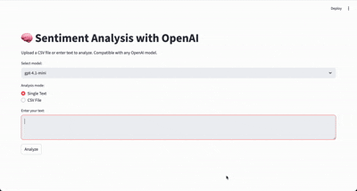

# 🧠 Sentiment Analysis App (OpenAI Powered)

A lightweight, production-ready sentiment analysis web application built with **Streamlit**, **Python**, and **OpenAI's Responses API**.

---

## 🎥 Demo



---

The app allows users to:

✓ Analyze a single piece of text  
✓ Upload a CSV file for batch sentiment analysis  
✓ Choose between multiple OpenAI models  
✓ Export results as CSV  
✓ View statistics and sentiment distribution charts  

This project is ideal for demos, client applications, internal analytics, and AI-driven text pipelines.

---

## 🚀 Features

- **Single text sentiment analysis**
- **Batch CSV processing** with:
  - label (positive / negative / neutral)
  - explanation
  - raw model response
- **Model selector** (supports:
  - `gpt-4.1-mini`
  - `gpt-4.1`
  - `gpt-4.1-preview`
  - `o3-mini`
- Clean, modern UI with Streamlit
- Graphical summary (metrics + bar chart)
- Error handling & JSON parsing fallback
- Lightweight and easy to deploy

---

## 📂 Project Structure


sentiment-poc/
│
├── app/
│ └── streamlit_app.py # Main Streamlit UI
│
├── src/
│ ├── analyzer.py # Core sentiment analysis logic (OpenAI API)
│ └── utils.py # CSV utilities
│
├── sample_data/
│ └── sample.csv # Example dataset
│
├── .env.example # Template for environment variables
├── .gitignore
├── requirements.txt
└── README.md # ← You are here

---

## 🛠 Installation

### 1. Clone the repository

```bash
git clone https://github.com/your-username/sentiment-analysis-app.git
cd sentiment-analysis-app
```

### 2. Create & activate a virtual environment

```bash
python3 -m venv venv
source venv/bin/activate
```

### 3. Install dependencies
```bash
pip install -r requirements.txt
```
### 4. Set up environment variables

Create a .env file in the root directory:
```bash
OPENAI_API_KEY=your_api_key_here
```

Or duplicate the included example:
```bash
cp .env.example .env
```
### ▶️ Running the App

Run Streamlit:

```bash
streamlit run app/streamlit_app.py
```

Open the local URL (usually: http://localhost:8501/)

## 🧪 Example CSV Format

The app expects a CSV file with a column named text:

text
"I really love this service!"
"The experience was terrible."
"Carlos did an acceptable job, nothing special."


Example file included in: sample_data/sample.csv

## 🧩 How It Works
1. analyze_sentiment()

- Sends a prompt to OpenAI's Responses API

- Requests strict JSON output

- Cleans and parses the model's response

- Fallback: If JSON fails, classifies using soft detection

2. analyze_csv()

- Reads CSV

- Processes each row

- Returns a DataFrame with:

  - text

  - label

  - explanation

  - raw response

3. streamlit_app.py

- UI components

- Single text and batch modes

- Sentiment summary visualization

- CSV export

## 📈 Example Output
```bash
{
  "label": "neutral",
  "explanation": "The text acknowledges that something works but implies there is room for improvement."
}
```

## 📦 Deployment Options

You can deploy this app easily on:

- Streamlit Cloud

- Render

- Railway

- Hugging Face Spaces

- Docker + Any cloud provider

(Dockerfile available on request.)

## 🔐 Environment Variables
Variable	           Description
OPENAI_API_KEY	   Your OpenAI API key

## 📝 Requirements

```bash
openai
pandas
streamlit
python-dotenv
```

## 🤝 Contribution

Pull requests, issues, and suggestions are welcome.

## 📄 License

MIT License — free to use and modify.

